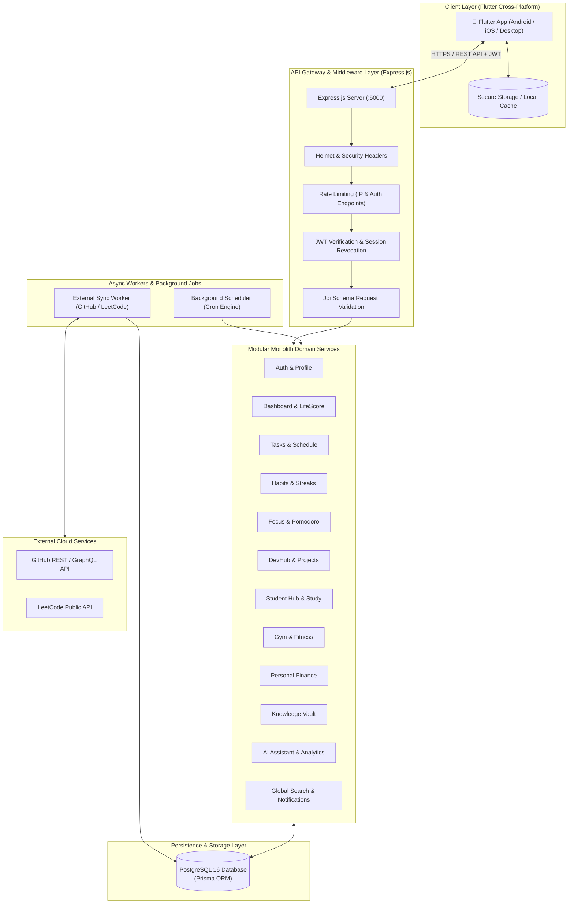
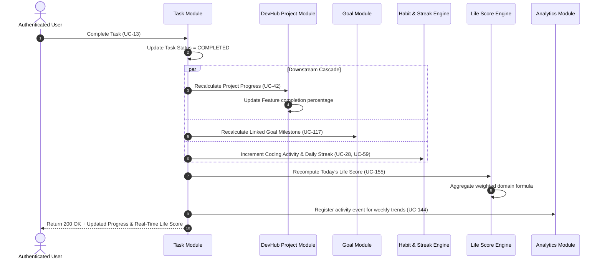

# HabOS (Personal Life Operating System)

> **A unified, reactive personal life operating system that consolidates 24 life domains—productivity, software engineering, academia, physical fitness, personal finance, knowledge management, and a real-time Life Score engine—into an interconnected ecosystem built with Flutter Clean Architecture and an Express/Prisma modular backend.**

---

[](https://nodejs.org/)
[](https://www.typescriptlang.org/)
[](https://expressjs.com/)
[](https://www.prisma.io/)
[](https://www.postgresql.org/)
[](https://flutter.dev/)
[](https://riverpod.dev/)
[](https://www.docker.com/)
[](LICENSE)

---

## 📖 Table of Contents

- [🌟 Project Overview](#-project-overview)
- [Problem Statement](#-problem-statement)
- [Objectives](#-objectives)
- [System Users & Roles](#-system-users--roles)
- [Key Features](#️-key-features)
- [System Architecture](#️-system-architecture)
  - [High-Level Architectural Diagram](#high-level-architectural-diagram)
  - [Frontend Architecture (Flutter Clean Architecture)](#frontend-architecture-flutter-clean-architecture)
  - [Backend Architecture (Modular Monolith)](#backend-architecture-modular-monolith)
  - [Inter-Module Reactive Cascade Flow](#inter-module-reactive-cascade-flow)
- [Tech Stack](#-tech-stack)
- [Repository Structure](#-repository-structure)
- [Developer Setup & Installation](#-developer-setup--installation)
  - [Prerequisites](#prerequisites)
  - [1. Clone Repository](#1-clone-repository)
  - [2. Backend Setup](#2-backend-setup)
  - [3. Frontend Setup (Flutter)](#3-frontend-setup-flutter)
- [ Database Setup](#️-database-setup)
  - [Migrations & Client Generation](#migrations--client-generation)
- [use Cases Index](#-use-cases-index)
- [Security](#-security)
- [Docker Setup](#-docker-setup)
- [Deployment](#-deployment)
- [Team & Responsibilities](#-team--responsibilities)

---

## Project Overview

**HabOS** is a modular personal life operating system engineered to eliminate digital fragmentation by uniting the tools people use every day into a reactive, single-source-of-truth ecosystem. 

Modern professionals, software developers, and students constantly juggle separate standalone applications for tasks (Todoist), habits (Habitica), focus timers (Forest), developer progress (GitHub), university courses (Canvas), gym workouts (Strong), finances (Splitwise/Sheets), and knowledge notes (Obsidian/Notion). This friction forces frequent context-switching and breaks feedback loops between different areas of daily life.

HabOS resolves this by implementing a **unified relational data fabric**:
- Completing a programming task automatically updates project milestone progress.
- Syncing GitHub commits and LeetCode solutions feeds software development streaks.
- Finishing an academic study session recalculates course syllabus velocity.
- Recording a workout logs personal records (PRs) and elevates the physical fitness index.
- All actions continuously update the **Life Score Engine** ($0 - 100$), giving users a single real-time snapshot of their personal momentum.

---

## 🚫 Problem Statement

Modern personal management is plagued by several core issues:

1. **Severe App Fragmentation & Context Fatigue**: Users must maintain 6 to 10 distinct applications daily to manage work, learning, health, and finances.
2. **Siloed, Disconnected Data**: Milestones achieved in code or university do not reflect in daily productivity summaries; health routines are completely isolated from cognitive performance data.
3. **Absence of a Holistic Feedback Loop**: Existing tools lack a composite metric that tracks overall consistency, leading to burnout in one area while neglecting others.
4. **Data Lock-In & Vendor Fragmentation**: Proprietary services keep personal data isolated across distinct clouds, exposing users to subscription fatigue and privacy concerns.
5. **Lack of Reactive Automation**: In conventional workflows, the user must manually update multiple tracking boards (e.g., mark a task done, update a project burndown, and log time spent separately).

---

## 🎯 Objectives

- **Consolidate 24 Core Life Domains**: Provide a centralized, coherent system covering tasks, schedules, habits, focus, software projects, GitHub/LeetCode sync, academic study, workouts, budgeting, notes, goals, and analytics.
- **Implement a Real-Time Composite Life Score**: Formulate a normalized ($0 - 100$) weighted scoring algorithm dynamically influenced by daily task fulfillment, coding activity, study time, gym adherence, and budget control.
- **Architect for Cross-Platform Reliability**: Deliver an offline-capable, responsive mobile client adhering strictly to Flutter Clean Architecture and Riverpod state management.
- **Build a Robust, Modular Monolith Backend**: Deploy an Express.js and TypeScript REST API with Prisma ORM, enforcing strict multi-tenant isolation where every database operation belongs to the authenticated user.
- **Ensure Enterprise-Grade Security & Privacy**: Implement stateless JWT authentication, refresh token family rotation, Joi request sanitization, IP rate limiting, and bcrypt password hashing.
- **Automate Background Routines**: Support cron-driven midnight streak recalculation, scheduled notification alerts, and automated external sync workers.

---

## 👥 System Users & Roles

### User Profiles

| Profile | Primary Needs & Workflows | Key Modules Utilized |
| :--- | :--- | :--- |
| **Software Engineers & Developers** | Tracking feature backlogs, bugs, GitHub commits, LeetCode problem solving, and technical roadmaps. | Dev Hub, GitHub Sync, LeetCode, Tech Learning, Focus Timer |
| **University Students & Academics** | Managing course syllabi, assignments, exams, grades, attendance, and timed study sessions. | Student Hub, Study Sessions, Calendar, Knowledge Vault |
| **Knowledge Workers & Organizers** | Deep work focus tracking, priority task matrix, time blocking, and Markdown second-brain note-taking. | Tasks, Schedule, Focus & Pomodoro, Knowledge Vault |
| **Fitness Enthusiasts** | Logging exercises, set/rep progressions, 1RM personal records, and body measurements. | Gym & Fitness, Body Metrics, Routines |
| **Personal Budgeters** | Tracking daily expenses and income, category thresholds, monthly budget caps, and savings rates. | Personal Finance, Budget Alerts, Analytics |


---

## 🛠️ Key Features

```
┌─────────────────────────────────────────────────────────────────────────────────────────────────┐
│                                       HabOS CORE DOMAINS                                        │
├───────────────────────────────┬───────────────────────────────┬─────────────────────────────────┤
│ 🚀 Productivity & Time        │ 💻 Software & Learning        │ 🏋️ Health & Finance             │
│ • Eisenhower Priority Matrix  │ • Dev Projects, Backlogs, Bugs│ • Workout & Exercise Set Logger │
│ • Time-Blocked Daily Schedule │ • GitHub Commits & PR Sync    │ • Auto 1RM & PR Detection       │
│ • Habit Streaks & Decay Logic │ • LeetCode Stats Integration  │ • Dual-Entry Income & Expense   │
│ • Deep Work & Pomodoro Timers │ • University Courses & Exams  │ • 80% Budget Threshold Warnings │
├───────────────────────────────┴───────────────────────────────┴─────────────────────────────────┤
│ 🧠 Intelligence, Vault & Analytics                                                              │
│ • Composite Real-Time Life Score (0 - 100) with Customizable Weights                             │
│ • Markdown Second-Brain Knowledge Vault with Code Snippets & Mistake Logs                       │
│ • AI Productivity Assistant & Automated Daily/Weekly Trend Analytics                            │
└─────────────────────────────────────────────────────────────────────────────────────────────────┘
```

### Detailed Domain Breakdown

1. **Task & Schedule Management**
   - Eisenhower Matrix categorization (`LOW`, `MEDIUM`, `HIGH`, `CRITICAL`).
   - Time estimation, due dates, and bidirectional links to Projects and Milestones.
   - Interactive calendar with recurring event scheduling and conflict detection.

2. **Habits & Focus Engine**
   - Daily and weekly habit completion tracking with streak retention and heatmap visualization.
   - Built-in Pomodoro and deep work timers categorized by activity (`CODING`, `STUDY`, `PROJECT`, `READING`).

3. **Developer Hub & Technical Learning**
   - Full software project lifecycle tracking (Kanban boards, feature backlogs, bug reproduction steps).
   - OAuth integration with GitHub (commit frequencies, active PRs, coding streaks).
   - LeetCode public profile scraper synchronizing solved problems categorized by difficulty (`Easy`, `Medium`, `Hard`).
   - Technology learning roadmap with resource attachment and progress tracking.

4. **Student Hub & Study Sessions**
   - Course catalog tracking semester credits, instructors, and class schedules.
   - Assignment deadline countdowns, exam weight calculators, and GPA/letter grade computation.
   - Dedicated study session timers directly linked to course syllabi.

5. **Gym & Fitness Tracker**
   - Workout templates and session logging (exercise, sets, weight in kg, repetitions).
   - Automatic 1RM calculation and Personal Record (PR) celebration banners.
   - Anthropometric body measurements (body weight, chest, waist, arms).

6. **Personal Finance**
   - Categorized income and expense logging with monthly budget limits.
   - Early threshold warnings ($80\%$ and $100\%$ budget alerts).
   - Monthly net savings rate and spending velocity analytics.

7. **Knowledge Vault & Second Brain**
   - Markdown note repository with category tagging and bidirectional note linking.
   - Dedicated code snippet library with syntax categorization and useful CLI command cheat sheets.
   - Structured "Mistakes & Learnings" ledger.

8. **Life Score & AI Analytics Engine**
   - Mathematical consistency composite score aggregating 7 active life domains into a single $0 - 100$ score.
   - Configurable domain weightings tailored to user priorities.
   - Natural language AI assistant providing personalized daily summaries and neglected area alerts.

---

## 🏗️ System Architecture

### High-Level Architectural Diagram

HabOS is designed as a client-server system featuring a cross-platform mobile client (Flutter) and a modular monolith backend (Node.js/Express + Prisma + PostgreSQL).



---

### Frontend Architecture (Flutter Clean Architecture)

The Flutter client adheres to strict **Clean Architecture** principles decoupled from external UI frameworks:

```
client/lib/
├── app/                  # Application startup, routing (GoRouter), theme setup
├── core/                 # Shared networking (Dio), errors, theme, constants
│   ├── network/          # Dio interceptors, auto token refresh, base client
│   ├── theme/            # HabOS Design System, typography, dark/light themes
│   └── errors/           # Failure models and exception handling
├── domain/               # Enterprise business rules (Pure Dart - ZERO UI / ZERO Dio)
│   ├── entities/         # Immutable business models (User, Task, Workout, Course)
│   ├── repositories/     # Abstract repository contracts
│   └── usecases/         # Business interactors (e.g., CompleteTaskUseCase)
├── data/                 # Data access layer
│   ├── models/           # DTOs with JSON serialization (fromJson / toJson)
│   ├── datasources/      # Remote (REST API) & Local (FlutterSecureStorage)
│   └── repositories/     # Repository implementations mapping DTOs to Entities
└── presentation/         # UI layer (Widgets, Screens, Riverpod StateNotifiers)
    ├── common/           # Universal UI widgets (cards, charts, buttons)
    └── modules/          # 24 Domain feature views matching backend domains
```

---

### Backend Architecture (Modular Monolith)

The Express backend uses a domain-driven **Modular Monolith** structure. Each domain under `server/src/modules/` is isolated into 4 clear layers:

```
server/src/modules/<domain>/
├── <domain>.routes.ts       # Route endpoints and middleware binding (Auth, Validation)
├── <domain>.controller.ts   # HTTP payload extraction, response formatting
├── <domain>.service.ts      # Pure business logic, Prisma queries, inter-module hooks
└── <domain>.validation.ts   # Strict Joi schemas for body, query, and path parameters
```

---

### Inter-Module Reactive Cascade Flow

When a core event occurs, HabOS triggers a downstream cascade across domain modules:



---

## 💻 Tech Stack

| Category | Technology | Version | Purpose & Rationale |
| :--- | :--- | :--- | :--- |
| **Mobile Client** | [Flutter](https://flutter.dev/) | `3.x` | Cross-platform UI toolkit compiling to native ARM code on iOS, Android, and Desktop. |
| **Language (Client)** | [Dart](https://dart.dev/) | `^3.0.0` | Strongly typed object-oriented language with null safety. |
| **State Management** | [Flutter Riverpod](https://riverpod.dev/) | `^2.5.1` | Compile-safe, testable state management without BuildContext coupling. |
| **Navigation** | [GoRouter](https://pub.dev/packages/go_router) | `^14.2.0` | Declarative routing with deep linking and path-based parameter parsing. |
| **Networking (Client)** | [Dio](https://pub.dev/packages/dio) | `^5.4.3` | Powerful HTTP client featuring interceptors, request retry, and JWT token rotation. |
| **Client Storage** | [Flutter Secure Storage](https://pub.dev/packages/flutter_secure_storage) | `^9.2.2` | Encrypted storage leveraging iOS Keychain and Android KeyStore. |
| **Visualizations** | [FL Chart](https://pub.dev/packages/fl_chart) | `^0.69.0` | Hardware-accelerated charting for trends, gym PR curves, and Life Score breakdowns. |
| **Backend Runtime** | [Node.js](https://nodejs.org/) | `20.x LTS` | High-throughput asynchronous event-driven JavaScript runtime. |
| **Language (Server)** | [TypeScript](https://www.typescriptlang.org/) | `^5.4.5` | End-to-end static typing ensuring strict data structures across modules. |
| **Web Framework** | [Express.js](https://expressjs.com/) | `^4.19.2` | Minimalist web framework handling routing and middleware pipelines. |
| **ORM** | [Prisma](https://www.prisma.io/) | `^5.14.0` | Next-generation type-safe ORM offering automated schema migrations. |
| **Primary Database** | [PostgreSQL](https://www.postgresql.org/) | `16 Alpine` | ACID-compliant relational database with strong relational indexing and JSON support. |
| **Validation** | [Joi](https://joi.dev/) | `^17.13.1` | Object schema validation for HTTP request bodies, queries, and headers. |
| **Security & Auth** | [JWT](https://jwt.io/) & [Bcrypt.js](https://github.com/dcodeIO/bcrypt.js) | `^9.0.2` / `^2.4.3` | Stateless token authentication with salted password hashing ($\ge 10$ rounds). |
| **Server Hardening** | [Helmet](https://helmetjs.github.io/) & [RateLimit](https://express-rate-limit.mintlify.app/) | `^7.1.0` / `^7.2.0` | HTTP header security and IP brute-force protection. |
| **Logging** | [Winston](https://github.com/winstonjs/winston) & [Morgan](https://github.com/expressjs/morgan) | `^3.13.0` / `^1.10.0` | Production JSON logging with audit trail output. |
| **Dev & Execution** | [tsx](https://github.com/privatenumber/tsx) | `^4.10.5` | Instant TypeScript execution and hot-reloading development runner. |
| **Containerization** | [Docker](https://www.docker.com/) & Docker Compose | Multi-stage | Reproducible multi-platform development and production container environments. |

---

## 📂 Repository Structure

```
Hab_os/
├── .agent                          # AI agent development guide & module taxonomy
├── docker-compose.yml              # Local orchestration (PostgreSQL 16 + Express API)
├── README.md                       # Comprehensive project documentation
├── docs/                           # Architecture, API versioning & use case specifications
│   ├── API_VERSIONING.md           # API evolution strategy and deprecation policies
│   ├── architecture.md             # Complete technical design & sequence diagrams
│   ├── usecases.md                 # 182 Use cases specification document
│   └── database/
│       └── schema_reference.md     # Detailed database model catalog
├── client/                         # Cross-Platform Flutter Mobile & Desktop Client
│   ├── pubspec.yaml                # Client dependencies and asset manifests
│   ├── analysis_options.yaml       # Dart analysis & linting configuration
│   ├── assets/                     # App icons, illustrations, and images
│   ├── lib/
│   │   ├── app/                    # Routing, global initialization & themes
│   │   ├── core/                   # Network client (Dio), error types, constants
│   │   ├── domain/                 # Pure business rules (Entities, Use Cases, Contracts)
│   │   ├── data/                   # Models (DTOs), Data Sources, Repository implementations
│   │   ├── presentation/           # Riverpod state notifiers, pages, shared widgets
│   │   └── main.dart               # App entrypoint wrapped in ProviderScope
│   └── test/                       # Flutter unit and widget test suites
└── server/                         # Express.js + TypeScript Modular REST Backend
    ├── package.json                # Server scripts and dependencies
    ├── tsconfig.json               # TypeScript compiler options
    ├── Dockerfile                  # Multi-stage production container build
    ├── .env.example                # Template for server environment variables
    ├── prisma/
    │   ├── schema.prisma           # Relational schema definition (50+ tables)
    │   └── seed.ts                 # Database seed script for initial testing data
    ├── scripts/                    # Maintenance, security & test runner scripts
    │   ├── reset-password.ts       # CLI utility to safely reset user passwords
    │   ├── test_runner.ts          # Master automated test suite runner
    │   ├── verify_architecture.js  # Clean architecture verification script
    │   └── verify_security.js      # Endpoint security & authentication auditor
    ├── tests/                      # Jest & tsx unit/integration test suites
    └── src/
        ├── server.ts               # HTTP server listener and graceful shutdown
        ├── app.ts                  # Express application configuration & route mapping
        ├── config/                 # Environment validation (Joi) & database client
        ├── middleware/             # Auth, error handling, rate limiting, logging
        └── modules/                # 24 Domain-driven feature modules
            ├── auth/               # Registration, login, token refresh
            ├── dashboard/          # Today's priorities & Life Score aggregator
            ├── lifescore/          # Mathematical consistency scoring engine
            ├── tasks/              # CRUD, prioritization, downstream triggers
            ├── schedule/           # Events, time blocking, calendars
            ├── habits/             # Routines, daily check-in, streak decay
            ├── focus/              # Pomodoro timer & deep work sessions
            ├── projects/           # Dev Hub projects, features, bug tracker
            ├── courses/            # University courses, assignments, exams, grades
            ├── gym/                # Workouts, set/rep logging, PR tracking
            ├── finance/            # Transactions, category budgets, savings rate
            ├── goals/              # Long-term goals & milestone roadmaps
            ├── vault/              # Markdown notes, code snippets, mistake logs
            ├── ai/                 # Intelligent personal planner & insights
            ├── search/             # Multi-entity global search service
            ├── notifications/      # Alert scheduler & notification queue
            ├── integrations/       # GitHub OAuth & LeetCode profile sync
            ├── tech/               # Tech learning roadmaps & skill progress
            └── analytics/          # Trend calculators (weekly/monthly)
```

---

## 🚀 Developer Setup & Installation

### Prerequisites

Ensure the following runtimes and tools are installed:
- **Node.js**: `v20.x LTS` or newer (`node -v`)
- **npm**: `v10.x` or newer (`npm -v`)
- **Flutter SDK**: `v3.19.x` or newer (`flutter --version`)
- **Docker & Docker Compose**: For containerized database execution (`docker compose version`)
- **PostgreSQL 16**: (Optional if running database via Docker)

---

### 1. Clone Repository

```bash
git clone https://github.com/boldhab/Hab_os.git
cd Hab_os
```

---

### 2. Backend Setup

1. **Navigate to the server directory**:
   ```bash
   cd server
   ```

2. **Install Node.js dependencies**:
   ```bash
   npm install
   ```

3. **Configure Environment Variables**:
   Copy `.env.example` to create `.env`:
   ```bash
   cp .env.example .env
   ```
   *(Adjust database connection details if necessary).*

4. **Spin up PostgreSQL via Docker** (if not using local Postgres):
   From the project root:
   ```bash
   docker compose up postgres -d
   ```

5. **Generate Prisma Client & Apply Migrations**:
   ```bash
   npm run prisma:generate
   npm run prisma:migrate
   ```

6. **Seed Initial Database Data**:
   ```bash
   npm run prisma:seed
   ```

7. **Start Development Server with Live-Reload**:
   ```bash
   npm run dev
   ```
   *The server starts on `http://localhost:5000` (Health Check: `http://localhost:5000/health`).*

---

### 3. Frontend Setup (Flutter)

1. **Navigate to the client directory**:
   ```bash
   cd ../client
   ```

2. **Install Flutter Dependencies**:
   ```bash
   flutter pub get
   ```

3. **Check Flutter Environment**:
   ```bash
   flutter doctor
   ```

4. **Launch Application**:
   Connect an emulator or physical device and run:
   ```bash
   flutter run
   ```

---

## 🗄️ Database Setup

HabOS utilizes **PostgreSQL 16** with **Prisma ORM**. The database schema is defined in `server/prisma/schema.prisma` and encompasses 50+ models organized across all 24 domains.

### Migrations & Client Generation

- **Generate Prisma Client**:
  ```bash
  cd server
  npm run prisma:generate
  ```
- **Apply Development Migrations**:
  Creates and runs timestamped SQL migration files:
  ```bash
  npm run prisma:migrate
  ```
- **Push Schema (Prototyping / Testing)**:
  Directly synchronizes schema without generating migration files:
  ```bash
  npm run prisma:push
  ```

---

## 📋 Use Cases Index

The HabOS specification defines **182 individual use cases** across all **24 domains** (detailed in [`docs/usecases.md`](file:///home/hab/Documents/projects/Habos/Hab_os/docs/usecases.md)):

<details>
<summary><b>Click to expand the Complete 24-Module Use Case Taxonomy (UC-01 to UC-182)</b></summary>

| Module # | Domain | Use Case ID & Title Range | Key Capabilities |
| :---: | :--- | :--- | :--- |
| **01** | **Auth & Profile** | `UC-01` – `UC-05` | Register Account, Login, Logout, Manage Profile, Notification Channels |
| **02** | **Dashboard** | `UC-06` – `UC-09` | View Today's Dashboard, Daily Summary, Progress Overview, Life Score Badge |
| **03** | **Task Management** | `UC-10` – `UC-17` | Create, Edit, Delete, Complete Task, Priority Matrix, Filter, Due Reminders |
| **04** | **Schedule** | `UC-18` – `UC-23` | Create, Edit, Delete Event, Daily Timeline, Weekly Schedule, Reminders |
| **05** | **Habits & Streaks** | `UC-24` – `UC-30` | Habit Definition, Mark Complete, Streak Engine, History Heatmap, Reminders |
| **06** | **Focus & Pomodoro** | `UC-31` – `UC-37` | Start, Pause, Resume, End Focus Session, Categorization, Focus Duration |
| **07** | **Dev Hub — Projects** | `UC-38` – `UC-42` | Create, Edit, Delete Project, View Project, Automatic Progress Calculation |
| **08** | **Dev Hub — Features** | `UC-43` – `UC-47` | Create Feature, Edit, Delete, Status Transitions (TODO/In Progress/Done) |
| **09** | **Dev Hub — Bugs** | `UC-48` – `UC-52` | Create Bug, Steps to Reproduce, Resolve Bug, Severity & Priority Management |
| **10** | **GitHub Integration** | `UC-53` – `UC-59` | Connect Account, Import Repos, Commits Feed, PR Tracking, Coding Streak |
| **11** | **LeetCode Integration**| `UC-60` – `UC-64` | Connect LeetCode, Solved Problems Sync, Difficulty Breakdown, Streak Sync |
| **12** | **Tech Learning** | `UC-65` – `UC-69` | Add Tech Track, Set Learning Progress, Resource Attachments, Status Updates |
| **13** | **Student Hub** | `UC-70` – `UC-83` | Courses, Assignments, Exams, Letter Grades, Attendance Ledger |
| **14** | **Study Sessions** | `UC-84` – `UC-90` | Start/End Study Session, Duration Logging, Course Notes, Study Statistics |
| **15** | **Gym & Fitness** | `UC-91` – `UC-101` | Workouts, Exercise Sets, Reps/Weights, Automatic PR Detection, Body Metrics |
| **16** | **Personal Finance** | `UC-102` – `UC-111`| Income/Expense Logging, Category Budgets, Savings Velocity, Monthly Reports |
| **17** | **Goals & Milestones**| `UC-112` – `UC-119`| Goal Roadmaps, Milestone Check-ins, Deadlines, Progress Aggregation |
| **18** | **Knowledge Vault** | `UC-120` – `UC-130`| Notes, Markdown Formatting, Code Snippets, Terminal Cheats, Mistake Ledger |
| **19** | **AI Assistant** | `UC-131` – `UC-143`| Natural Language Inquiries, Daily Guidance, Neglected Area Detection |
| **20** | **Analytics & Trends**| `UC-144` – `UC-154`| Weekly/Monthly Aggregations, Cross-Domain Trend Charts, Progress Reports |
| **21** | **Life Score Engine** | `UC-155` – `UC-158`| Composite Score Formula ($0 - 100$), Domain Breakdown, Trend Comparison |
| **22** | **Notifications** | `UC-159` – `UC-166`| Task, Exam, Goal, Streak, and Budget Alerts, Quiet Hours Suppression |
| **23** | **Global Search** | `UC-167` – `UC-172`| Multi-Domain Full-Text Fuzzy Search across all entity collections |
| **24** | **Settings & Portability**| `UC-173` – `UC-182`| Layout Customization, Domain Weights, Data Export (JSON), Account Deletion |

</details>

---

## 🔐 Security

Security in HabOS is implemented defensively across every layer of the architecture:

- **Stateless Dual-Token Authentication**:
  - **Access Token**: Short-lived ($15\text{ minutes}$), signed using HMAC SHA-256 (`HS256`).
  - **Refresh Token**: Long-lived ($30\text{ days}$), stored in the database with revocation tracking. Implements refresh token rotation with family revocation to mitigate token replay attacks.
- **Client-Side Secret Storage**:
  - Stored exclusively via `flutter_secure_storage` utilizing hardware Keystore on Android and Keychain Services on iOS.
- **Cryptographic Password Protection**:
  - Passwords are never stored in plain text. Salted and hashed using `bcryptjs` with $\ge 10$ rounds.
- **Zero Direct SQL Vulnerabilities**:
  - Prisma ORM utilizes parameterized statements across all queries, preventing SQL injection.
- **Strict Multi-Tenant Isolation**:
  - Every protected database operation is strictly scoped by `userId` extracted from verified JWT payloads.
- **Request Validation & Hardening**:
  - Incoming payloads are strictly checked against **Joi** schemas before reaching service controllers.
  - **Helmet** enforces security headers (HSTS, Content-Security-Policy, XSS filter, frameguard).
  - **CORS** whitelisting blocks unauthorized external browser origins.
  - **express-rate-limit** throttles brute-force attempts on sensitive endpoints (`/api/v1/auth/*`).

---


## 👥 Team & Responsibilities

| Contributor | CTC | 
| :--- | :--- | 
| **Habtamu Befekadu**<br> | CTC-894-26
| **Petros Geto**<br> | CTC-2934-26
### Contributing


---

<p align="center">
  <b>HabOS</b> — <i>Take control of your life operating system.</i>
</p>
