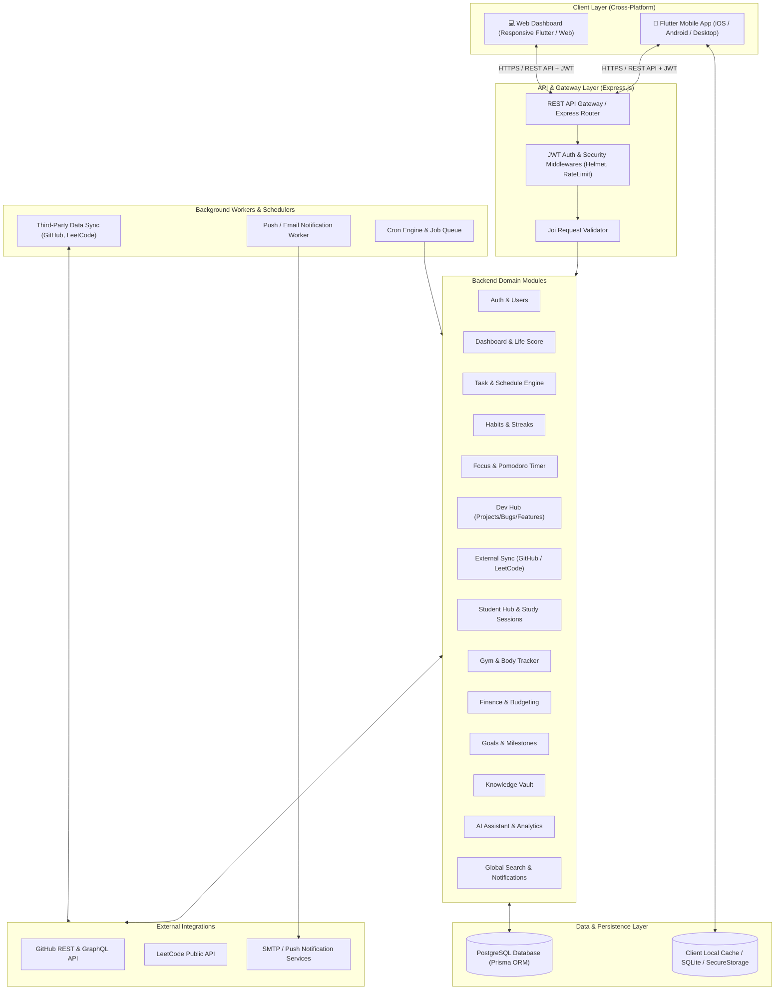
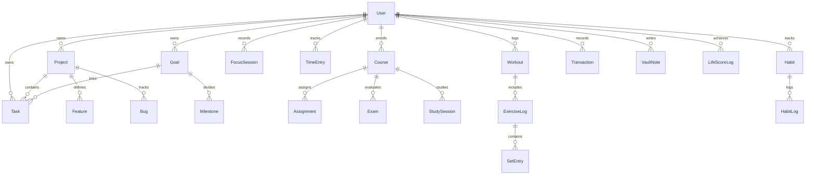
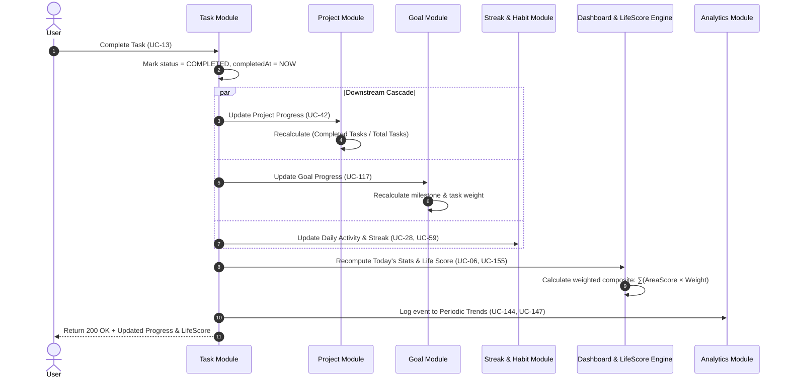
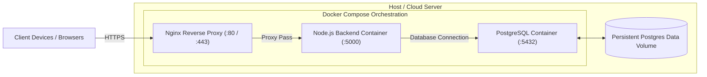

# HabOS — System Architecture & Design Document

## 1. Executive Summary & Vision

**HabOS** is an integrated personal life operating system designed to unify productivity, software development, academic learning, physical fitness, personal finance, knowledge management, and goal attainment into a single cohesive ecosystem. 

Unlike fragmented single-purpose tools (e.g., separate apps for todo lists, workout trackers, budget sheets, and note taking), HabOS establishes a unified data fabric where actions in one domain automatically influence, update, and enrich insights in others (for example: completing a coding task advances a project milestone, updates coding streaks, recalculates the daily Life Score, and feeds the AI productivity assistant).

---

## 2. High-Level System Architecture

HabOS is architected as a modern client-server system featuring a cross-platform mobile client built with Flutter (Clean Architecture) and a modular backend powered by Node.js/Express and PostgreSQL with Prisma ORM.



---

## 3. Frontend Architecture (Flutter Client)

The mobile application follows strict **Clean Architecture** principles decoupled with **Riverpod / BLoC** state management to ensure testability, separation of concerns, and offline capability.

```
client/lib/
├── app/                  # Application initialization, routing & global config
├── core/                 # Shared utilities, constants, theme, networking & error handlers
│   ├── network/          # HTTP client (Dio), interceptors, auth token refresh
│   ├── theme/            # HabOS Design System, typography, colors, dark/light mode
│   ├── utils/            # Date formatting, math helpers, validators
│   └── errors/           # Failure models & exception handling
├── domain/               # Enterprise business rules & use cases (pure Dart, zero UI dependency)
│   ├── entities/         # Core business objects (User, Task, Workout, Transaction, etc.)
│   ├── repositories/     # Abstract repository contracts
│   └── usecases/         # Individual use case interactors (e.g., CompleteTaskUseCase)
├── data/                 # Data access and storage implementations
│   ├── models/           # DTOs with JSON serialization (fromJson / toJson)
│   ├── datasources/      # Remote (REST API) & Local (SQLite / Hive / FlutterSecureStorage)
│   └── repositories/     # Concrete repository implementations mapping DTOs to Entities
└── presentation/         # UI layer (Flutter widgets, pages, state notifiers)
    ├── common/           # Shared reusable widgets (CustomCard, StatBadge, ChartView)
    ├── navigation/       # App routing & bottom navigation bar
    └── modules/          # Feature UI modules matching backend domains:
        ├── auth/         # Login, Register, Profile screens
        ├── dashboard/    # Today's overview, Life Score widget, daily summaries
        ├── tasks/        # Task lists, filters, quick-add, time blocking
        ├── habits/       # Habit streak cards, completion buttons, heatmaps
        ├── focus/        # Pomodoro & deep work timer screens
        ├── devhub/       # Projects, features, bug tracker, GitHub/LeetCode stats
        ├── student/      # Courses, assignments, exam countdowns, study timers
        ├── gym/          # Workouts, set/rep loggers, PR celebrations, weight charts
        ├── finance/      # Expense logger, budget bars, category breakdowns
        ├── goals/        # Milestones progress, goal roadmap
        ├── vault/        # Knowledge notes, code snippets, search
        ├── ai_assistant/ # Conversational interface & recommendations
        └── settings/     # Preference controls, exports, integrations
```

### Clean Architecture Data Flow:
1. **User Interaction** in `presentation` invokes a state notifier/provider.
2. The notifier executes a specific **`UseCase`** in the `domain` layer.
3. The **`UseCase`** calls the repository contract (`domain/repositories`).
4. The **`RepositoryImpl`** in the `data` layer orchestrates between local cached data (`LocalDataSource`) and remote server endpoints (`RemoteDataSource`).
5. DTOs are mapped to immutable domain **`Entities`** and returned to the UI for reactive rendering.

---

## 4. Backend Architecture (Node.js / Express / Prisma)

The server is built as a **Modular Monolith** designed for high cohesion and low coupling.

```
server/src/
├── server.js             # HTTP server entry point and lifecycle management
├── app.js                # Express app configuration, global middleware registration
├── config/               # Environment variables, database connection, JWT settings
├── common/               # Shared response formatters, constants, base error classes
├── middleware/           # Cross-cutting middlewares:
│   ├── auth.js           # JWT verification & token extraction
│   ├── validate.js       # Joi request schema validation wrapper
│   ├── errorHandler.js   # Global unhandled error & Prisma exception catcher
│   ├── rateLimiter.js    # Rate limiting for brute-force protection
│   └── logger.js         # Winston & Morgan logging middleware
├── modules/              # Domain-driven backend modules:
│   ├── auth/             # Registration, login, token refresh, password hashing
│   ├── tasks/            # CRUD, prioritization, due dates, completion triggers
│   ├── schedule/         # Events, calendar feeds, time blocking
│   ├── habits/           # Habit definitions, daily completions, streak calculations
│   ├── focus/            # Focus sessions, duration calculations, tagging
│   ├── projects/         # Dev Hub projects, features, bug tracking
│   ├── github/           # GitHub OAuth, repository sync, commit/PR metrics
│   ├── leetcode/         # Public profile fetcher, solved problems, streaks
│   ├── learning/         # Tech learning progress, skill tracks, resources
│   ├── student/          # Courses, assignments, exams, grades, attendance
│   ├── study/            # Study timer sessions, course linkage, notes
│   ├── gym/              # Workouts, exercises, sets/reps, PR detection, body metrics
│   ├── finance/          # Transactions, category budgets, savings calculations
│   ├── goals/            # Long-term goals, milestones, deadline tracking
│   ├── vault/            # Knowledge vault notes, code snippets, tagging, search
│   ├── ai/               # Data aggregator, recommendation engine, daily insights
│   ├── analytics/        # Periodic trend aggregation (weekly/monthly charts)
│   ├── lifescore/        # Composite consistency score computation engine
│   ├── notifications/    # Notification trigger rules, scheduling, dispatching
│   ├── search/           # Global cross-module fuzzy search service
│   └── settings/         # User preferences, dashboard layout, data export
├── jobs/                 # Automated background workers (Cron jobs):
│   ├── streakChecker.js  # Midnight streak verification & penalty checks
│   ├── reminderJob.js    # Task/Exam/Schedule notification scheduler
│   └── externalSync.js   # Background sync for connected developer accounts
└── utils/                # Date/time calculators, crypto helpers, math algorithms
```

### Module Structure Pattern
Every backend module follows a standard 4-layer structure:
- **`routes.js`**: Declares HTTP endpoints and applies route-specific middlewares (auth, validation).
- **`controller.js`**: Extracts request parameters, coordinates with the service layer, and sends standardized JSON responses.
- **`service.js`**: Houses pure business logic, calculations, inter-module updates, and transactions.
- **`validation.js`**: Defines strict Joi schemas for request body, query, and path parameters.

---

## 5. Database Schema & Data Models (PostgreSQL + Prisma)

The relational schema is centered around the `User` entity, ensuring robust multi-tenant data isolation where every single record belongs directly or indirectly to an authenticated user.



### Primary Database Models:

1. **Identity & Core Configuration**:
   - `User`: ID, email, password hash, name, avatar, timezone, preferences, createdAt, updatedAt.
   - `UserPreference`: Dashboard module order, active targets, notification channels.

2. **Productivity & Execution**:
   - `Task`: Title, description, status (`TODO`, `IN_PROGRESS`, `COMPLETED`), priority (`LOW`, `MEDIUM`, `HIGH`, `CRITICAL`), dueDate, estimatedMinutes, projectId, goalId, completedAt.
   - `ScheduleEvent`: Title, description, startTime, endTime, isRecurring, recurrencePattern, color.
   - `Habit`: Name, frequency (`DAILY`, `WEEKLY`), targetValue, reminderTime, currentStreak, longestStreak.
   - `HabitLog`: HabitId, completedDate, status, note.
   - `FocusSession`: DurationMinutes, category (`CODING`, `STUDY`, `PROJECT`, `READING`, `OTHER`), taskId, notes.

3. **Software Development & Tracking**:
   - `Project`: Title, description, repoUrl, status, progress, technologies.
   - `Feature`: Title, description, status (`TODO`, `IN_PROGRESS`, `COMPLETED`, `BLOCKED`), priority, projectId.
   - `Bug`: Title, description, stepsToReproduce, priority, status (`OPEN`, `IN_PROGRESS`, `RESOLVED`, `CLOSED`), projectId.
   - `GitHubIntegration`: AccessToken, username, lastSyncedAt, dailyCommitsCache.
   - `LeetCodeIntegration`: Username, easyCount, mediumCount, hardCount, streakCount.
   - `TechLearning`: TechnologyName, status (`LEARNING`, `PRACTICING`, `COMPLETED`), progressPercentage, resources.

4. **Academic & Learning**:
   - `Course`: CourseName, courseCode, semester, instructor, credits, progress.
   - `Assignment`: Title, dueDate, status (`NOT_STARTED`, `IN_PROGRESS`, `SUBMITTED`, `GRADED`), courseId.
   - `Exam`: Title, examDate, weight, examType (`MIDTERM`, `FINAL`, `QUIZ`), courseId.
   - `Grade`: ItemType, itemId, score, maxScore, letterGrade.
   - `StudySession`: DurationMinutes, notes, courseId, date.

5. **Health & Fitness**:
   - `Workout`: Name, date, startTime, durationMinutes, notes.
   - `ExerciseLog`: WorkoutId, exerciseName, category.
   - `SetEntry`: ExerciseLogId, setNumber, weightKg, repetitions, isPR.
   - `BodyMeasurement`: Date, weightKg, chestCm, waistCm, armsCm.

6. **Personal Finance**:
   - `Transaction`: Amount, type (`INCOME`, `EXPENSE`), category (`FOOD`, `TRANSPORT`, `EDUCATION`, `BILLS`, etc.), date, description.
   - `Budget`: Category, monthlyLimit, month, year.

7. **Knowledge & Self-Improvement**:
   - `Goal`: Title, description, targetDate, priority, category, progress.
   - `Milestone`: Title, status, goalId.
   - `VaultNote`: Title, content, category, tags, codeSnippets, relatedNoteIds.
   - `LifeScoreLog`: Date, overallScore, taskScore, codingScore, studyScore, gymScore, habitScore, financeScore.

---

## 6. Inter-Module Event Propagation & Reactive Workflows

HabOS operates on a reactive domain chain where critical user actions trigger cascade recalculations:



---

## 7. Life Score Engine Architecture

The **Life Score** is a normalized composite metric ($0 - 100$) reflecting personal consistency across active life domains:

$$\text{Life Score} = \frac{\sum_{i=1}^{N} \left( \text{AreaScore}_i \times \text{Weight}_i \right)}{\sum_{i=1}^{N} \text{Weight}_i}$$

### Area Score Computations:
1. **Tasks ($\text{Area}_1$)**: $\frac{\text{Completed Tasks Due Today}}{\text{Total Tasks Due Today}} \times 100$
2. **Coding ($\text{Area}_2$)**: Based on GitHub commits + Focus coding minutes / daily target.
3. **Study ($\text{Area}_3$)**: Study duration vs. semester course targets + upcoming assignment status.
4. **Gym ($\text{Area}_4$)**: Workout completion against weekly scheduled frequency.
5. **Habits ($\text{Area}_5$)**: $\frac{\text{Habits Completed Today}}{\text{Total Active Daily Habits}} \times 100$.
6. **Finance ($\text{Area}_6$)**: Budget adherence ratio: $\max\left(0, 100 - \frac{\text{Actual Expenses}}{\text{Budgeted Limit}} \times 100\right)$.
7. **Goals ($\text{Area}_7$)**: Active milestone progress velocity.

Weights are fully configurable by the user via **UC-177**.

---

## 8. Cross-Cutting Concerns & Security

### 1. Authentication & Session Management
- **Stateless JWT Architecture**:
  - Access Token: Short-lived ($15\text{ minutes}$), signed with `HS256` or `RS256`, containing `userId` and token version.
  - Refresh Token: Long-lived ($30\text{ days}$), stored encrypted in the database with revocation tracking.
  - Client side: Stored securely via `flutter_secure_storage` (Keychain on iOS, Keystore/EncryptedSharedPreferences on Android).

### 2. Request Validation & Sanitization
- All incoming payloads pass through schema validators implemented with **Joi** before reaching the controller.
- SQL injection prevention guaranteed via parameterized queries in **Prisma ORM**.

### 3. Application Hardening
- **Helmet**: Secures HTTP headers (XSS filter, frameguard, HSTS).
- **CORS**: Strict origin whitelisting.
- **Rate Limiting**: IP and user-based throttling on sensitive endpoints (`/api/auth/*`).
- **Audit Logging**: Winston structured JSON logs for audit trails and monitoring.

---

## 9. Deployment & DevOps Architecture

HabOS is containerized using Docker for reproducible multi-environment deployments.



### Database Migration Strategy:
- **Development**: `prisma migrate dev` captures schema changes into timestamped SQL migrations.
- **Production**: `prisma migrate deploy` applies verified migrations during container startup before the HTTP listener binds.
- **Database Seeding**: `prisma/seed.js` initializes default categories, targets, and demonstration data.

---

## 10. Summary Mapping: Use Cases to Architecture Modules

| Architectural Subsystem | Covered Use Cases | Key Database Entities |
|-------------------------|-------------------|-----------------------|
| **Auth & Security** | UC-01 – UC-05, UC-182 | `User`, `UserPreference` |
| **Dashboard & Life Score** | UC-06 – UC-09, UC-155 – UC-158, UC-174, UC-177 | `LifeScoreLog`, `UserPreference` |
| **Task Management** | UC-10 – UC-17, UC-167 | `Task`, `TimeEntry` |
| **Schedule & Calendar** | UC-18 – UC-23 | `ScheduleEvent` |
| **Habits & Streaks** | UC-24 – UC-30, UC-152, UC-162, UC-165 | `Habit`, `HabitLog` |
| **Focus & Time Engine** | UC-31 – UC-37 | `FocusSession`, `TimeEntry` |
| **Developer Hub** | UC-38 – UC-52, UC-168 | `Project`, `Feature`, `Bug` |
| **Integrations (GitHub/LeetCode)** | UC-53 – UC-64, UC-148, UC-179, UC-180 | `GitHubIntegration`, `LeetCodeIntegration` |
| **Tech Learning** | UC-65 – UC-69 | `TechLearning` |
| **Student Hub & Study** | UC-70 – UC-90, UC-149, UC-160, UC-170 | `Course`, `Assignment`, `Exam`, `Grade`, `StudySession` |
| **Gym & Fitness** | UC-91 – UC-101, UC-150, UC-163 | `Workout`, `ExerciseLog`, `SetEntry`, `BodyMeasurement` |
| **Personal Finance** | UC-102 – UC-111, UC-151, UC-164, UC-171 | `Transaction`, `Budget` |
| **Goals & Roadmap** | UC-112 – UC-119, UC-161 | `Goal`, `Milestone` |
| **Knowledge Vault** | UC-120 – UC-130, UC-169 | `VaultNote` |
| **AI Assistant & Analytics** | UC-131 – UC-143, UC-144 – UC-154 | Aggregate queries across all modules |
| **Notifications & Search** | UC-159 – UC-166, UC-172, UC-178 | Cross-module indexing & notification queue |
| **Settings & Data Portability** | UC-173 – UC-176, UC-181 | `UserPreference`, backup exporter |
