# HabOS Database Schema Reference

This document provides a detailed mapping of the complete PostgreSQL relational database schema managed by Prisma ORM for all 24 modules of HabOS.

---

## 1. Schema Overview

```mermaid
erDiagram
    users ||--o{ refresh_tokens : has
    users ||--o| user_preferences : has
    users ||--o{ categories : defines
    users ||--o{ life_score_logs : records
    users ||--o{ tasks : owns
    users ||--o{ schedule_events : schedules
    users ||--o{ focus_sessions : logs
    users ||--o{ habits : maintains
    users ||--o{ projects : manages
    users ||--o| github_integrations : connects
    users ||--o| leetcode_integrations : connects
    users ||--o{ tech_learnings : studies
    users ||--o{ courses : takes
    users ||--o{ workouts : performs
    users ||--o{ transactions : logs
    users ||--o{ budgets : sets
    users ||--o{ goals : pursues
    users ||--o{ vault_notes : writes
    users ||--o{ notifications : receives

    projects ||--o{ tasks : contains
    projects ||--o{ features : defines
    projects ||--o{ bugs : tracks

    goals ||--o{ milestones : has
    goals ||--o{ tasks : links

    habits ||--o{ habit_logs : records

    courses ||--o{ assignments : assigns
    courses ||--o{ exams : tests
    courses ||--o{ attendances : marks
    courses ||--o{ study_sessions : studies

    workouts ||--o{ workout_exercises : contains
    workout_exercises ||--o{ set_entries : has
    exercises ||--o{ workout_exercises : performs
    exercises ||--o{ personal_records : records
```

---

## 2. Table Specifications by Subsystem

### Subsystem A: Authentication, Identity & Configuration
1. **`users`**: Master user record (`id`, `email`, `password`, `name`, `avatarUrl`, `timezone`, `dateFormat`, `createdAt`, `updatedAt`).
2. **`refresh_tokens`**: Stateful JWT refresh tokens for secure session revocation (`id`, `token`, `userId`, `expiresAt`, `revoked`).
3. **`user_preferences`**: User-level configuration (`dashboardModules`, `dailyCodingTargetMins`, `dailyStudyTargetMins`, `dailyReadingTargetMins`, `weeklyGymTarget`, `quietHoursStart`, `quietHoursEnd`, `lifeScoreWeights`).
4. **`categories`**: Universal multi-purpose categories for tasks, habits, finance, and vault notes (`id`, `name`, `color`, `icon`, `type`, `userId`).

### Subsystem B: Dashboard & Consistency Scoring
5. **`life_score_logs`**: Daily snapshot of composite Life Score and individual domain sub-scores (`overallScore`, `taskScore`, `codingScore`, `studyScore`, `gymScore`, `habitScore`, `financeScore`, `date`).

### Subsystem C: Tasks, Calendar & Focus
6. **`tasks`**: Actionable tasks with priorities, status transitions, deadlines, project/goal associations (`id`, `title`, `description`, `priority`, `status`, `dueDate`, `estimatedMinutes`, `completedAt`, `projectId`, `goalId`, `categoryId`, `userId`).
7. **`schedule_events`**: Time-blocked schedule entries (`title`, `startTime`, `endTime`, `isRecurring`, `recurrenceRule`, `location`, `color`).
8. **`focus_sessions`**: Pomodoro and deep work timers (`startTime`, `endTime`, `durationMinutes`, `category`, `notes`, `taskId`).
9. **`time_entries`**: Granular task time tracking (`startTime`, `endTime`, `duration`, `taskId`).

### Subsystem D: Habits & Streaks
10. **`habits`**: Daily/weekly routine definitions with streak counters (`name`, `frequency`, `targetType`, `targetValue`, `currentStreak`, `longestStreak`, `reminderTime`, `isActive`).
11. **`habit_logs`**: Daily completion records for each habit (`habitId`, `date`, `isCompleted`, `value`, `notes`).

### Subsystem E: Developer Hub & Integrations
12. **`projects`**: Software projects (`title`, `description`, `repoUrl`, `status`, `progress`, `technologies`, `color`).
13. **`features`**: Feature backlog items for projects (`name`, `description`, `status`, `priority`, `projectId`, `assignedTaskId`).
14. **`bugs`**: Issue and defect tracking (`title`, `description`, `stepsToReproduce`, `priority`, `status`, `resolvedAt`, `resolutionNotes`, `projectId`).
15. **`github_integrations`**: Cached GitHub statistics (`username`, `accessToken`, `totalCommits`, `publicReposCount`, `currentStreak`, `longestStreak`, `lastSyncedAt`).
16. **`leetcode_integrations`**: LeetCode stats (`username`, `totalSolved`, `easySolved`, `mediumSolved`, `hardSolved`, `currentStreak`, `longestStreak`).
17. **`tech_learnings`**: Technology learning tracks (`name`, `status`, `progressPercentage`, `priority`, `resources`).

### Subsystem F: Academic & Study Hub
18. **`courses`**: Academic courses (`name`, `code`, `semester`, `instructor`, `credits`, `progress`, `color`).
19. **`assignments`**: Course assignments (`title`, `description`, `dueDate`, `status`, `grade`, `maxGrade`, `courseId`).
20. **`exams`**: Exam schedules and results (`title`, `examDate`, `startTime`, `examType`, `weight`, `grade`, `maxGrade`, `courseId`).
21. **`attendances`**: Attendance records (`date`, `status`, `notes`, `courseId`).
22. **`study_sessions`**: Focused study timers linked to courses (`startTime`, `endTime`, `durationMinutes`, `notes`, `courseId`).

### Subsystem G: Health, Gym & Fitness
23. **`workouts`**: Workout sessions (`name`, `date`, `startTime`, `durationMinutes`, `notes`, `isCompleted`).
24. **`exercises`**: Exercise catalog (`name`, `category`, `notes`).
25. **`workout_exercises`**: Join table mapping exercises to a specific workout with ordering (`workoutId`, `exerciseId`, `order`).
26. **`set_entries`**: Individual sets with weight and reps (`setNumber`, `weightKg`, `repetitions`, `isPR`, `notes`).
27. **`personal_records`**: Detected personal bests (`exerciseId`, `weightKg`, `repetitions`, `calculatedOneRepMax`, `achievedDate`).
28. **`body_metrics`**: Physical measurements log (`date`, `weightKg`, `chestCm`, `waistCm`, `armsCm`, `legsCm`).

### Subsystem H: Personal Finance
29. **`transactions`**: Incomes and expenses (`amount`, `type`, `date`, `description`, `source`, `categoryId`).
30. **`budgets`**: Monthly category spending caps (`monthlyLimit`, `month`, `year`, `categoryId`).

### Subsystem I: Goals & Roadmaps
31. **`goals`**: Long-term aspirations (`title`, `description`, `targetDate`, `priority`, `category`, `status`, `progress`).
32. **`milestones`**: Key checkpoints dividing goals (`title`, `description`, `targetDate`, `status`, `isCompleted`, `goalId`).

### Subsystem J: Knowledge Vault & Notifications
33. **`vault_notes`**: Markdown notes, code snippets, mistake documentation (`title`, `content`, `tags`, `codeSnippets`, `isMistakeSolution`, `categoryId`).
34. **`note_links`**: Bidirectional links between knowledge notes (`sourceNoteId`, `targetNoteId`).
35. **`notifications`**: Scheduled and dispatched alerts (`title`, `message`, `type`, `isRead`, `scheduledFor`, `sentAt`, `metadata`).
